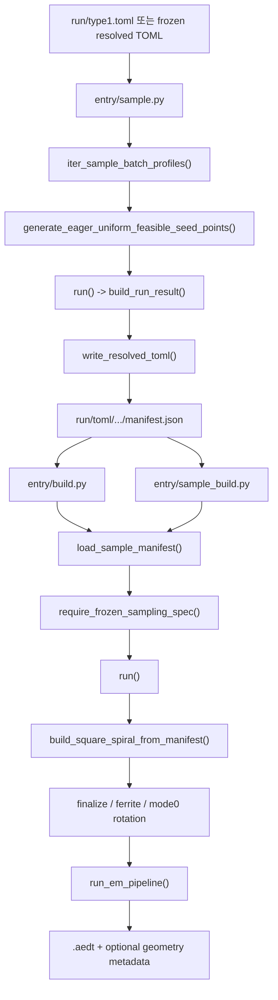

# 현재 파이프라인 분석

## 전체 흐름도



## 엔트리포인트 역할
- `entry/sample.py`: 기본 batch profile 집합을 계산하고, 각 batch마다 resolved TOML들과 batch `manifest.json`을 생성한다.
- `entry/build.py`: `entry/sample.py`와 같은 batch profile 집합을 다시 순회하면서 각 `manifest.json`을 읽어 build를 수행한다.
- `entry/sample_build.py`: 새 sample을 만들지 않고, 이미 만들어진 batch `manifest.json`들을 순차 replay build하는 디버그 entry다.

현재 entry 계층에서 사라진 것:
- `multi_sample.py`, `multi_build.py`, `build_one.py`, `sample_one_build.py` 같은 별도 우회 entry는 현재 active path가 아니다.

실행 특성:
- `entry/sample.py`는 batch 간 병렬화는 가능하지만, batch 내부 design 생성은 현재 직렬로 수행한다.
- `entry/build.py`는 headless runtime일 때만 manifest 내부 entry build를 병렬화할 수 있다.
- GUI-visible build는 항상 순차 실행된다.
- `stop_on_error=False`는 더 이상 지원되지 않는다.

## 샘플링과 selection 단계
- 샘플링 시작점은 `entry/sample.py::generate_all_sample_manifests()`다.
- 기본 batch series는 `iter_sample_batch_profiles()`가 `total_toml_count`, `batch_toml_count`, `sparsity_ratio` 계열 상수로 계산한다.
- 각 batch는 `generate_sample_manifest()`로 들어가고, 먼저 `generate_eager_uniform_feasible_seed_points()`로 feasible seed를 찾는다.
- 개별 seed는 `generate_sample_artifact_for_seed()`가 처리하며, 내부적으로 `run()`을 호출해 manifest/snapshot을 만든 뒤 frozen resolved TOML을 기록한다.

selection 내부의 핵심 흐름:
- `run()`
- `_select_feasible_result()`
- `resolve_selection_result()`
- sampling registry/preflight
- scalar selection
- coil group resolution
- group geometry 파생
- PCB resolution/normalization
- constraint validation

재시도 계약:
- seed 하나당 최대 재시도 횟수는 `64`회다.
- `SelectionConstraintError`만 재시도 대상이고, 그 외 오류는 즉시 실패한다.

현재 `tx_vertical` 계약:
- `coil_placement.tx_vertical_orientation_mode`는 `0` 또는 `1`만 지원한다.
- `0`은 `no tx_vertical coil` 모드다.
- `1`은 legacy `ZX tx_vertical` 모드다.
- 실험하던 `YZ` mode-2는 현재 active path에 없다.
- `mode 0`이어도 sampling ledger에는 `coil_groups[tx_vertical].count_range` owner가 남지만, realized `selected_count`는 `0`으로 고정된다.

현재 실제 호출 체인은 아래와 같다.

```python
generate_all_sample_manifests()
-> generate_sample_manifest()
-> generate_eager_uniform_feasible_seed_points()
-> generate_sample_artifact_for_seed()
-> run()
-> write_resolved_toml()
-> write_sample_manifest()
```

## `run()`과 sample 산출물
- `run()`은 `spec_version`, backend/tool, TOML basename 길이, simulation/outputs 계약을 먼저 검사한다.
- TOML basename 길이가 `30`자를 넘으면 즉시 실패한다.
- backend는 현재 `hfss`만 허용한다.
- `build_run_result()`는 hash, `design_id`, manifest, `source_toml_bytes`, `repro_snapshot`, `dataset_snapshot`을 조립한다.

resolved TOML 생성 방식:
- `write_resolved_toml()`은 원본 spec을 다시 읽는다.
- `result["repro_snapshot"]["toml_bytes"]`를 기준으로 sampled owner range만 `count=1`의 frozen range로 바꾼다.
- 선택된 PCB `present`/`mounts`도 replay 기준의 canonical 값으로 다시 써 넣는다.

batch manifest 기록:
- `write_sample_manifest()`는 `design_id`, `seed`, `retry_attempt`, `toml_path`, `source_toml_path`, 각종 hash를 JSON 배열로 저장한다.
- build 단계는 이 batch manifest만 읽고 replay를 시작한다.

## frozen TOML replay build
- build 시작점은 `entry/build.py::build_all_targets_with_options()`다.
- 기본 대상은 `iter_default_build_targets()`가 sample batch profile과 같은 규칙으로 계산한다.
- target manifest가 하나라도 없으면 건너뛰지 않고 즉시 `FileNotFoundError`를 낸다.

개별 entry build 흐름:
- `load_sample_manifest()`
- `require_frozen_sampling_spec()`
- `run()`
- `_apply_sample_identity()`
- `build_square_spiral_from_manifest()`

중요한 replay 계약:
- build 입력 TOML은 sampled owner 전부가 frozen 상태여야 한다.
- replay `run()`은 frozen TOML에서 manifest를 다시 만들지만, 최종적으로는 sample 단계의 `design_id`, hash, seed, retry 값을 `_apply_sample_identity()`로 덮어써 identity를 유지한다.
- geometry build에 들어가면 manifest의 `repro_mode`는 `manifest_json`으로 전환된다.

정리/실패 처리:
- 성공/실패와 관계없이 `.aedtresults`는 정리한다.
- 실패 시 `.aedt`, `.aedt.lock`, optional manifest/metadata/zip 산출물도 함께 정리한다.
- build는 기본적으로 fail-fast다. 첫 실패에서 멈춘다.

## geometry build
- geometry build 진입점은 `src/peetsfea/backend/pyaedt/geometry/build.py::build_square_spiral_from_manifest()`다.
- 현재 고정 순서는 아래와 같다.
  - `_prepare_runtime()`
  - `create_hfss_session()`
  - `_assign_design_variables()`
  - `_build_scene()`
  - `_build_all_coils()`
  - `_build_tx_ferrite()`
  - `_finalize_geometry()`
  - `_build_rx_ferrite()`
  - `_build_and_save_metadata()`
  - `_close_hfss_desktop()`

코일 빌드 계층:
- `_build_all_coils()`는 PCB별로 `tx_dd`, `tx_vertical`, `rx_dd`를 순회한다.
- `tx_vertical`은 `selected_count == 0`이면 geometry 생성 자체를 건너뛴다.
- `tx_dd`는 `stacked_mode=0/1`에서 파생된 layer count를 기준으로 neo builder를 탄다.
- `tx_vertical` active path는 현재 `ZX` 전용이다.

finalize 계층:
- `_finalize_geometry()`는 `finalize_solids_and_substrates()`를 통해 RX back-stub, TX vertical, TX DD start stub, TX bridge, global unite, semantic port, FR4 저장 단계를 묶어서 처리한다.
- TX/RX 포트는 detached sheet 가정이 아니라 finalized conductor 기준 explicit port 계약으로 내려온다.

`tx_vertical_orientation_mode = 0`의 추가 동작:
- finalize plan 내부에서 `rotate_tx_mode0_plan_objects_if_needed()`가 실행된다.
- 이 단계는 finalized TX DD 객체를 `Y`축 기준으로 회전시켜 `tx_region_dd` top 계약을 맞춘다.
- 회전 후 CAD probe, endpoint, bbox, placement violation도 다시 계산한다.
- 회전 결과는 geometry metadata의 `tx_dd_rotation_angle_deg`, `tx_dd_rotation_pivot_xyz`, `tx_dd_rotation_object_names`에 기록된다.

현재 geometry 계층의 중요한 사실:
- `tx_vertical_plane`는 realized 값으로만 유지되며 현재 `"ZX"`로 고정된다.
- `RX` 코일 plane은 계속 `YZ`다.
- `YZ tx_vertical`은 더 이상 geometry build active path에 포함되지 않는다.

## EM pipeline
- EM 진입점은 `src/peetsfea/backend/pyaedt/em_pipeline/runner.py::run_em_pipeline()`다.
- 현재 실행 순서는 아래와 같다.
  - `build_groups()`
  - `build_series()`
  - `build_subtract()`
  - `build_boundary()`
  - `build_ports()`
  - `apply_sources_phase()`
  - `build_analysis()`
  - `build_post_templates()`
  - `validate_pipeline()`

현재 계약:
- `build_ports()`는 geometry finalize 단계가 만든 explicit port를 그대로 사용한다.
- TX 포트 1개, RX 포트 1개가 아니면 즉시 실패한다.
- `validation_gate == "hard_fail"`이면 TX/RX conductor group이 없을 때 즉시 실패한다.
- `outputs` 테이블은 report/post template의 SSOT다.

## 산출물과 디버그 경로

| 산출물 | 생성 시점 | 현재 저장 위치 | 용도 |
| --- | --- | --- | --- |
| 원본 입력 TOML | 샘플 시작 전부터 존재 | 보통 `run/type1.toml` | sampling space의 원본 SSOT다. |
| resolved `.toml` | `write_resolved_toml()` | `run/toml/toml_<version>_<seed_start>/<design_id>.toml` | build replay 입력용 frozen spec이다. |
| batch `manifest.json` | `write_sample_manifest()` | `run/toml/toml_<version>_<seed_start>/manifest.json` | build 단계가 읽는 batch entry 목록이다. |
| per-design manifest JSON | `run()` with `emit_manifest_json=True` | `run/aedt/aedt_<version>_<seed_start>/manifest_<design_id>.json` | 기본 플로우에서는 보통 비활성이다. |
| `.repro.toml` 논리 산출물 | `run()` | 기본 플로우에서는 `RunResult["repro_snapshot"]["toml_bytes"]` | exact replay snapshot이다. |
| `.dataset.toml` 논리 산출물 | `run()` | 기본 플로우에서는 `RunResult["dataset_snapshot"]["toml_bytes"]` | sampled owner ledger snapshot이다. |
| `.aedt` | geometry/EM 완료 후 | `run/aedt/aedt_<version>_<seed_start>/<design_id>.aedt` | HFSS 프로젝트 본체다. |
| `geometry_metadata_<design_id>.json` | `_build_and_save_metadata()` 후 | `run/aedt/...`에 optional 저장 | geometry/EM/rotation 디버그용 metadata다. |

기본 플로우에서 디스크에 바로 쓰지 않는 것:
- `.repro.toml`
- `.dataset.toml`
- `.source.toml`
- zip export

현재 VS Code 디버그 경로:
- `run-sample-debug` task는 `run/toml/`을 비운 뒤 `run/`에서 `entry/sample.py`를 실행한다.
- `Run entry/sample_build.py from run/` launch는 `prepare-build-debug` 이후 `run/`에서 `entry/sample_build.py`를 실행한다.
- `entry/sample_build.py`는 기존 manifest replay만 수행하며, 새 sample 생성은 하지 않는다.

## type2 확장 시 현재 결합 지점
- selection 계층은 여전히 `tx_dd`, `tx_vertical`, `rx_dd` kind와 fixed PCB order를 전제로 한다.
- geometry 계층은 `build_square_spiral_from_manifest()`가 세 kind와 현재 plane 계약(`tx_vertical=ZX`, `rx=YZ`)을 고정으로 본다.
- `tx_vertical_orientation_mode`의 공개 입력도 사실상 `0=no vertical`, `1=ZX vertical`의 2값 계약에 묶여 있다.
- EM context의 `source`는 현재 `"type1_geometry"`로 고정된다.
- 재사용 관점의 세부 분리는 sibling 문서인 [docs/type2-reuse.md](docs/type2-reuse.md)를 본다.
