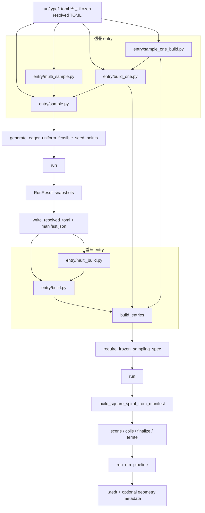

# 현재 파이프라인 분석

## 전체 흐름도



## 엔트리포인트 역할
- `entry/sample.py`: seed range에서 feasible seed를 고르고, 각 seed에 대해 `run()`을 호출해 resolved TOML과 batch `manifest.json`을 만든다.
- `entry/multi_sample.py`: 여러 `SampleProfile`에 대해 `entry/sample.py` 경로를 병렬 또는 순차로 반복한다.
- `entry/build.py`: batch `manifest.json`을 읽고 각 entry에 대해 frozen TOML을 다시 검증한 뒤 build를 수행한다.
- `entry/multi_build.py`: `run/toml/**/manifest.json`을 훑어 여러 batch를 차례로 `entry/build.py`에 넘긴다.
- `entry/build_one.py`: 샘플 100개를 먼저 만든 뒤 GUI-visible runtime으로 순차 build한다.
- `entry/sample_one_build.py`: `entry/build_one.py`의 단건 버전이다.

## 샘플링 단계
- 샘플 단계의 시작점은 `entry/sample.py::generate_sample_manifest()`다.
- 이 함수는 먼저 `generate_eager_uniform_feasible_seed_points()`를 호출해 seed range 전체에서 feasible point를 찾는다.
- feasible 판정은 `uniform_seedset.py::_first_feasible_point()` 안에서 `resolve_selection_result(spec, seed, attempt)`를 반복 호출하는 방식이다.
- 한 seed에 대해 시도 횟수는 최대 `64`회이고, 이 값은 `entry/sample.py::DEFAULT_EAGER_MAX_ATTEMPTS`와 `run_design.py::MAX_ATTEMPTS`로 각각 드러난다.
- selection 내부에서는 아래 흐름이 유지된다.
  - sampling registry/preflight
  - scalar selection
  - coil group selection
  - group geometry 파생
  - PCB resolution/normalization
  - constraint validation

```python
selected_points = generate_eager_uniform_feasible_seed_points(...)
entry = generate_sample_artifact_for_seed(...)
result = run(config)
```

## manifest/repro/dataset/resolved TOML 생성
- `generate_sample_artifact_for_seed()`는 각 seed마다 `run()`을 호출한다.
- `run()`은 spec을 읽고 manifest를 조립하며, 동시에 `source_toml_bytes`, `repro_snapshot`, `dataset_snapshot`을 `RunResult` 안에 넣는다.
- 그 다음 `write_resolved_toml()`이 `repro_snapshot`을 사용해 sampled range만 얼린 resolved TOML을 디스크에 기록한다.
- 마지막으로 `write_sample_manifest()`가 batch 단위 `manifest.json`을 `run/toml/toml_<version>_<seed_start>/manifest.json`에 저장한다.

현재 실제 호출 체인은 아래 순서다.

```python
generate_eager_uniform_feasible_seed_points(...)
-> run()
-> write_resolved_toml(...)
-> write_sample_manifest(...)
```

## frozen TOML 재검증 후 build
- build 단계는 resolved TOML을 다시 읽고 `require_frozen_sampling_spec(spec)`를 먼저 통과해야 한다.
- 이 gate는 `build_aedt_from_manifest_entry_with_options()` 안에 있으며, non-frozen spec이면 `run()` 자체를 다시 호출하지 않는다.
- gate를 통과하면 build 단계에서도 `run()`을 한 번 더 호출해 manifest를 재구성한다.
- 이후 sample manifest에 들어 있던 `design_id`, hash, seed, retry 정보를 `_apply_sample_identity()`로 다시 덮어써 샘플 단계의 identity를 유지한다.
- `entry/build.py::build_entries()`는 기본 non-graphical runtime일 때만 병렬 처리하고, GUI-visible runtime이면 강제로 순차 처리한다.

```python
load_sample_manifest(...)
-> require_frozen_sampling_spec(spec)
-> run(config)
-> _apply_sample_identity(...)
-> build_square_spiral_from_manifest(manifest)
```

## geometry build
- geometry build 진입점은 `src/peetsfea/backend/pyaedt/geometry/build.py::build_square_spiral_from_manifest()`다.
- 내부 순서는 고정돼 있다.
  - `_prepare_runtime()`
  - `create_hfss_session()`
  - `_assign_design_variables()`
  - `_build_scene()`
  - `_build_all_coils()`
  - `_finalize_geometry()`
  - `_build_ferrite()`
  - `_build_and_save_metadata()`
- `_build_all_coils()`는 현재 `tx_dd`, `tx_vertical`, `rx_dd` 세 kind를 하드코딩으로 분기한다.
- `_finalize_geometry()`는 bridge/stub/fr4/port용 보조 형상을 합치고, `_build_and_save_metadata()`는 `build_em_artifacts()`까지 이어서 EM 입력용 객체 묶음을 만든다.

실제 build 체인은 아래 한 줄로 요약된다.

```python
run()
-> build_square_spiral_from_manifest()
-> scene/coils/finalize/ferrite
-> build_em_artifacts()
```

## EM pipeline
- EM 단계 진입점은 `src/peetsfea/backend/pyaedt/em_pipeline/runner.py::run_em_pipeline()`다.
- geometry 단계가 만든 `EmPipelineInput`을 받아 아래 순서로 실행한다.
  - `build_groups()`
  - `build_series()`
  - `build_subtract()`
  - `build_boundary()`
  - `build_ports()`
  - `apply_sources_phase()`
  - `build_analysis()`
  - `build_post_templates()`
  - `validate_pipeline()`
- 이 레이어는 HFSS 실행 정책과 post template 구성을 처리하는 공통층에 가깝다.
- 다만 `build_em_artifacts()`가 만드는 `em_context["source"]`는 현재 `"type1_geometry"`로 고정돼 있다.

```python
em_input = {"ready_objects": ..., "endpoints": ..., "context": ...}
run_em_pipeline(hfss, modeler, em_input, em_policy, outputs)
```

## 산출물/정리

| 산출물 | 생성 시점 | 현재 저장 위치 | 용도 |
| --- | --- | --- | --- |
| 원본 입력 TOML | 샘플 시작 전부터 존재 | 보통 `run/type1.toml` | sampling space의 원본 SSOT다. |
| resolved `.toml` | `write_resolved_toml()` | `run/toml/toml_<version>_<seed_start>/<design_id>.toml` | build 단계가 다시 읽는 frozen sampled spec이다. |
| batch `manifest.json` | `write_sample_manifest()` | `run/toml/toml_<version>_<seed_start>/manifest.json` | build 단계에 넘길 entry 목록이다. |
| `.repro.toml` 논리 산출물 | `run()` | 현재 기본 플로우에서는 `RunResult["repro_snapshot"]["toml_bytes"]`로 유지 | exact replay snapshot 계약이다. |
| `.dataset.toml` 논리 산출물 | `run()` | 현재 기본 플로우에서는 `RunResult["dataset_snapshot"]["toml_bytes"]`로 유지 | canonical sampled owner ledger 계약이다. |
| `.source.toml` 논리 산출물 | `run()` | 현재 기본 플로우에서는 `RunResult["source_toml_bytes"]`로 유지 | 실행 당시 원본 TOML byte snapshot이다. |
| `.aedt` | geometry build 완료 후 | `run/aedt/aedt_<version>_<seed_start>/<design_id>.aedt` | HFSS 프로젝트 본체다. |
| `geometry_metadata_<design_id>.json` | `_build_and_save_metadata()` 후 | 기본 비활성, 옵션일 때만 `run/aedt/...`에 저장 | geometry/EM metadata 디버그용 산출물이다. |

- `.repro.toml`, `.dataset.toml`, `.source.toml`은 현재 기본 경로에서는 디스크 파일로 직접 쓰이지 않는다.
- 다만 `src/peetsfea/pipeline/package_export.py`에 zip export 계약이 남아 있어 파일명 규약 자체는 이미 정의돼 있다.
- 실패 시 `build_aedt_from_manifest_entry_with_options()`가 `.aedt`, `.aedt.lock`, `.aedtresults`, optional metadata/zip을 정리한다.
- 성공 시에도 `cleanup_aedtresults()`가 `.aedtresults` 디렉터리를 제거한다.
- GUI-visible build는 `entry/build.py::build_entries()`에서 병렬이 강제로 꺼진다.

## type2 확장 시 결합 지점
- selection 쪽은 `GROUP_KIND_ORDER`, `FIXED_PCB_RULES`, scalar owner path 집합이 `type1` 이름에 묶여 있다.
- geometry 쪽은 `build_square_spiral_from_manifest()`가 필수 kind를 `tx_dd`, `tx_vertical`, `rx_dd`로 가정한다.
- scene/ferrite 쪽은 TV/wall/rx face 배치 계약이 현재 `type1` 환경을 전제로 한다.
- EM 쪽은 대부분 재사용 가능하지만 `em_context["source"] = "type1_geometry"`는 분리 대상이다.
- 재사용 관점의 세부 분류는 sibling 문서인 [docs/type2-reuse.md](docs/type2-reuse.md)를 본다.
