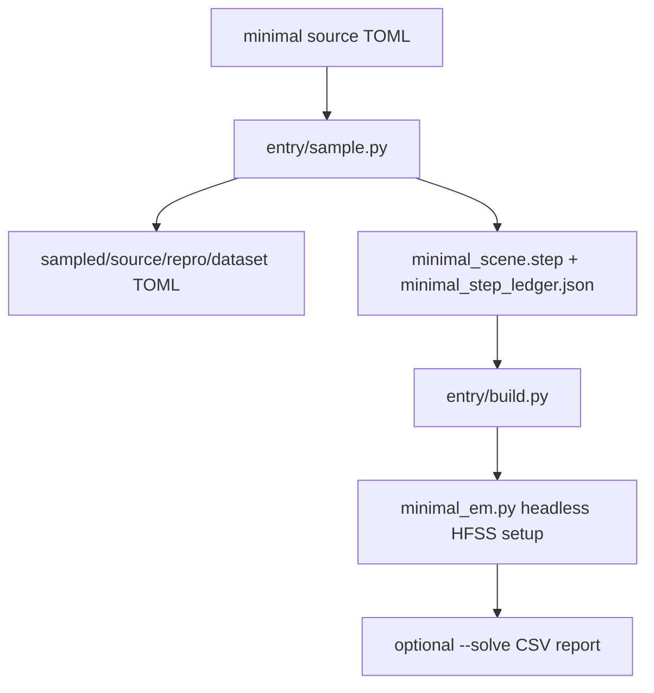

# Sample Build Flow

## Notes
- The generated STEP contains authored non-model boxes plus fixed Tx/Rx port cells.
- Mesh, ports, sources, setup, sweep, and report creation are owned by [minimal_em.py](../code/src/peetsfea/backend/pyaedt/minimal_em.py.md).
- Old geometry generation branches are outside the 0.3.0 graph.
