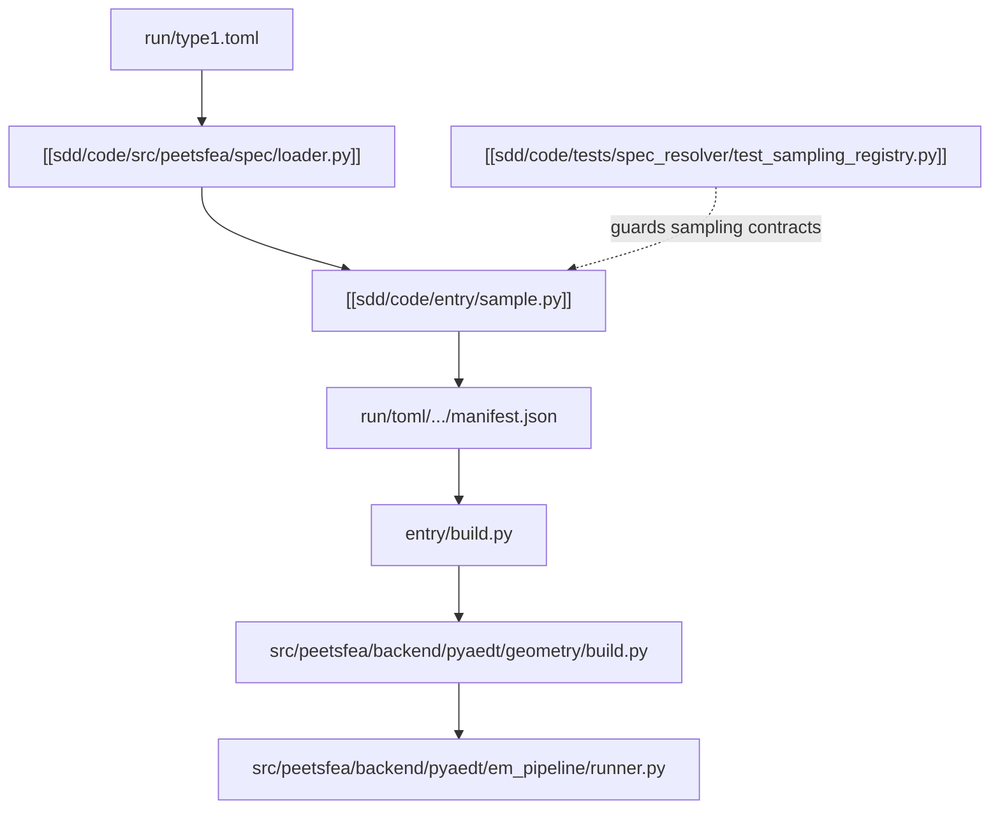

# Sample Build Flow

이 구조도는 현재 샘플링에서 build replay로 넘어가는 흐름의 SDD 요약이다. 서술형 설명은 [[sdd/architecture/current-pipeline-sdd-view]], 자세한 분석은 [[docs/current-pipeline]]를 본다.

## Notes
- loader 단계는 fallback 없이 parse/shape 오류를 raise한다.
- sample 단계는 batch profile, seed selection, manifest write를 묶는다.
- 테스트 노트는 sampling registry와 preflight fail-fast 계약을 대표 예시로 가리킨다.

## Links
- [[sdd/index]]
- [[sdd/architecture/current-pipeline-sdd-view]]
- [[sdd/code/entry/sample.py]]
- [[sdd/code/src/peetsfea/spec/loader.py]]
- [[sdd/code/tests/spec_resolver/test_sampling_registry.py]]
