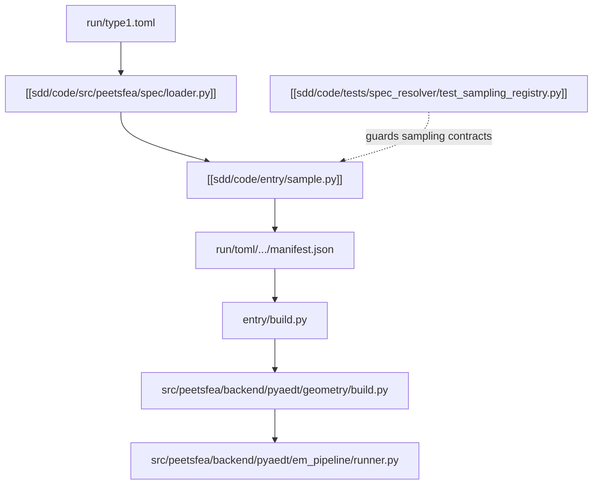
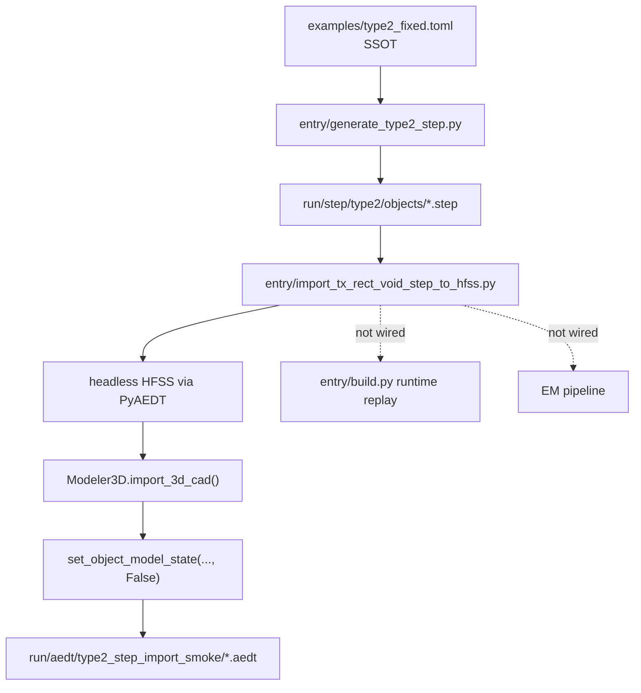

# Sample Build Flow

이 구조도는 현재 샘플링에서 build replay로 넘어가는 흐름의 SDD 요약이다. 서술형 설명은 [[sdd/architecture/current-pipeline-sdd-view]], 자세한 분석은 [[docs/current-pipeline]]를 본다.

## Notes
- loader 단계는 fallback 없이 parse/shape 오류를 raise한다.
- sample 단계는 batch profile, seed selection, manifest write를 묶는다.
- 테스트 노트는 sampling registry와 preflight fail-fast 계약을 대표 예시로 가리킨다.

## Type2 STEP Import Smoke Flow

이 흐름은 `examples/type2_fixed.toml`에서 생성된 type2 STEP artifact를 HFSS로 가져오는 opt-in smoke path다. `entry/build.py` runtime replay나 EM pipeline에는 아직 연결하지 않는다.

## Related notes
- [[sdd/plans/0.2.22-type2-pyaedt-step-import]]
- [[sdd/code/entry/import_non_model_step_to_hfss.py]]
