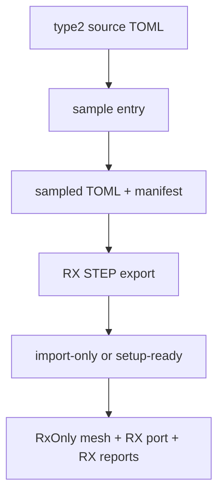

# Sample Build Flow

## Notes
- TX shape-specific flow details were removed for the 0.2.24 reset.
- `tx_region` may remain as guide context only.
- Report variables are owned by [type2-em-report-contract](../architecture/type2-em-report-contract.md).
