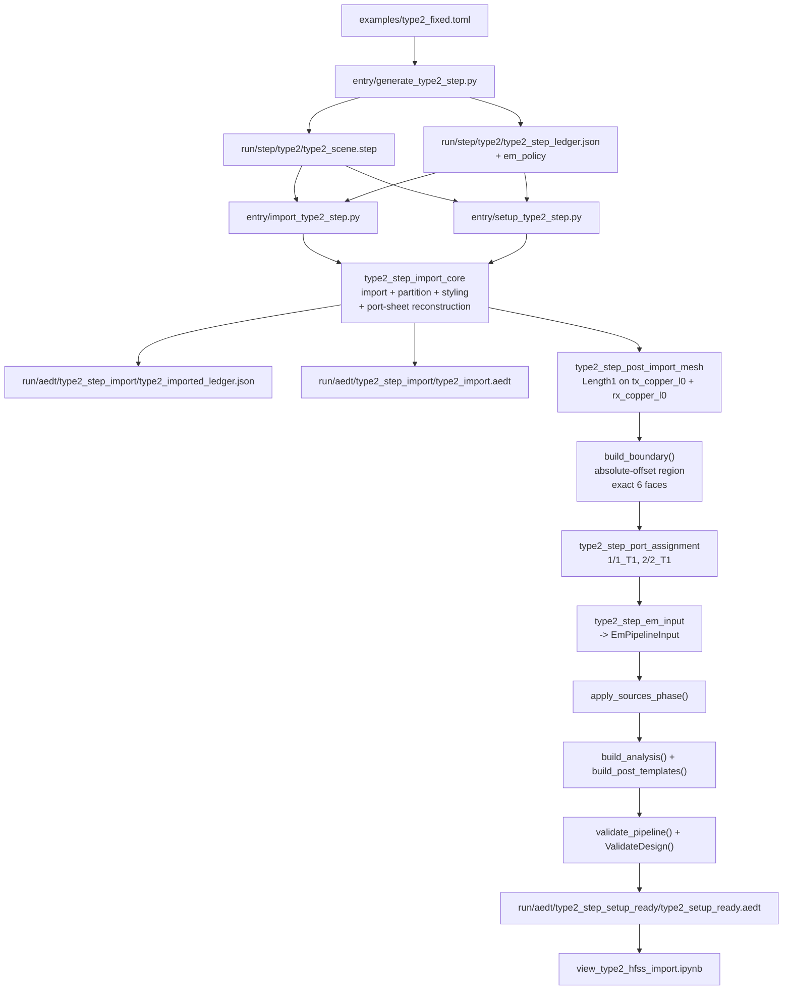

# Type2 STEP to EM Validate Flow

## Notes
- import-only와 setup-ready는 서로 다른 owner surface다.
- imported ledger는 import handoff artifact다. setup-ready summary를 JSON으로 누적하지 않는다.
- `tx_port_sheet` / `rx_port_sheet`는 STEP exact-name body가 아니라 metadata-driven reconstructed sheet다.
- radiation boundary와 explicit lumped port는 setup-ready runtime이 1회만 만든다.
