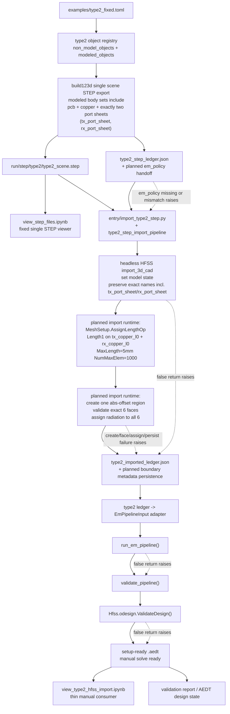

# Type2 STEP to EM Validate Flow

이 다이어그램은 `examples/type2_fixed.toml`에서 canonical single scene STEP, retained metadata ledger, imported ledger, setup-ready HFSS state, 이후 EM validation까지 이어지는 flow를 보여준다. Import+Ledger 구현 계획은 [[sdd/plans/0.2.22-type2-import-ledger-pipeline]], single scene/setup-ready 방향은 [[sdd/plans/0.2.22-type2-single-step-setup-ready-pipeline]], 상위 계획은 [[sdd/plans/0.2.22-type2-step-to-em-validate-pipeline]], TOML 단일화 계획은 [[sdd/plans/0.2.22-type2-toml-unification]], 아키텍처 설명은 [[sdd/architecture/type2-step-to-em-validate-pipeline]]다.

## Notes
- `examples/type2_fixed.toml` is the single planned public authoring input.
- future canonical STEP artifact is one full-scene file: `run/step/type2/type2_scene.step`.
- The STEP ledger and imported ledger are the canonical role/coordinate handoff; the retained boundary-policy field is documented as top-level `em_policy` on `type2_step_ledger.json`.
- future single-coil modeled exact-name sets also include one separate port-sheet body per coil: `tx_port_sheet`, `rx_port_sheet`.
- The planned radiation-boundary handoff keeps policy ownership in the type2 input and STEP ledger. The import runtime is only the consumer that creates the region and applies the boundary.
- The current notebook failure is caused by importer-side drift that still expects `import_time_policy`; canonical docs remain on `em_policy` and leave the runtime correction to follow-up code work.
- Import+Ledger is implemented by [[sdd/code/entry/import_type2_step.py]] and [[sdd/code/src/peetsfea/backend/pyaedt/type2_step_import_pipeline.py]].
- The current single-coil setup-ready baseline also includes a runtime-owned post-import mesh step: `MeshSetup.AssignLengthOp(...)` named `Length1` on `tx_copper_l0` and `rx_copper_l0` with `RefineInside=False`, `Enabled=True`, `RestrictElem=False`, `NumMaxElem="1000"`, `RestrictLength=True`, `MaxLength="5mm"`.
- The future setup-ready import path is expected to reuse the existing type1-style region/radiation helper contract: one absolute-offset region, exactly 6 faces, and one radiation assignment per face.
- Boundary metadata persistence is also planned: the imported ledger should retain requested `em_policy` plus realized region/face/assignment summary once the runtime implements that path.
- the port-sheet bodies are planned reference surfaces for a later lumped-port adapter and are not documented here as already wired to HFSS ports.
- Post-import material/color/transparency is applied by the runtime, not by the notebook.
- `view_step_files.ipynb` is a fixed-path scene viewer, not an index/registry selector notebook.
- Validation includes both repository EM readiness and AEDT design validation, with policy gaps, region-create failures, non-6-face regions, radiation assignment failures, and boundary metadata persistence failures treated as fail-fast import-time errors.
- `view_type2_hfss_import.ipynb` is a thin manual consumer of runtime-owned setup-ready/manual-solve-ready state, not an owner of that behavior.
- GUI validation is intentionally outside this planned path.
