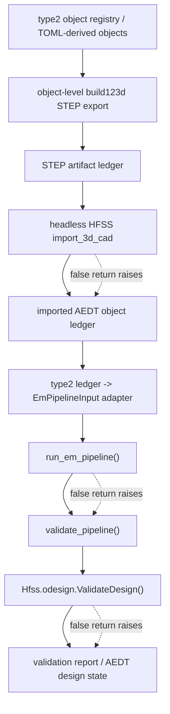

# Type2 STEP to EM Validate Flow

이 다이어그램은 type2 object-level STEP artifact에서 EM validation까지의 planned flow를 보여준다. 상위 계획은 [[sdd/plans/0.2.22-type2-step-to-em-validate-pipeline]], 아키텍처 설명은 [[sdd/architecture/type2-step-to-em-validate-pipeline]]다.

## Notes
- STEP artifact granularity is object-level, not one monolithic compound for the full type2 scene.
- The ledger is the canonical role/coordinate handoff; AEDT geometry reverse-calculation is not part of the flow.
- Validation includes both repository EM readiness and AEDT design validation.
- GUI validation is intentionally outside this planned path.
