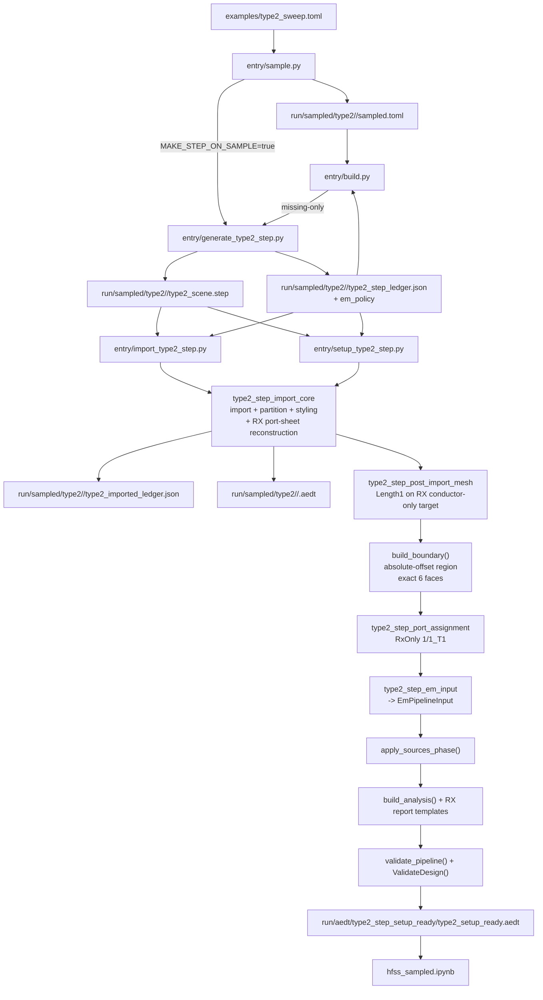

# Type2 STEP to EM Validate Flow

## Notes
- import-only와 setup-ready는 서로 다른 owner surface다.
- `entry/sample.py`의 STEP export는 optional이고, `entry/build.py`가 missing STEP을 same-worker에서 보완할 수 있다.
- imported ledger는 import handoff artifact다. setup-ready summary를 JSON으로 누적하지 않는다.
- RX port sheet는 STEP exact-name body가 아니라 metadata-driven reconstructed sheet다.
- RxOnly mode creates one RX port and RX report variables only.
- Active report variables are defined by [type2-em-report-contract](../architecture/type2-em-report-contract.md).
- TX geometry SDD is intentionally removed; `tx_region` may remain as a non-modeled future guide only.
- import에서 RX modeled body가 generic `SOLID*`로 보이면 export contract failure로 본다.
- radiation boundary와 explicit lumped port는 setup-ready runtime이 1회만 만든다.
- RxOnly setup-ready는 source phase, RX analysis/report, `validate_pipeline()`,
  `ValidateDesign()`, final save까지 full EM chain을 같은 순서로 수행한다.
- mesh owner는 계속 RX conductor-only다. `tx_region` guide와 reconstructed port-sheet는 mesh target set에 들어가지 않는다.

## Handoff
- Owning architecture: [type2-step-to-em-validate-pipeline](../architecture/type2-step-to-em-validate-pipeline.md)
- Primary plan: [0.2.22-type2-import-ledger-pipeline](../plans/0.2.22-type2-import-ledger-pipeline.md)
