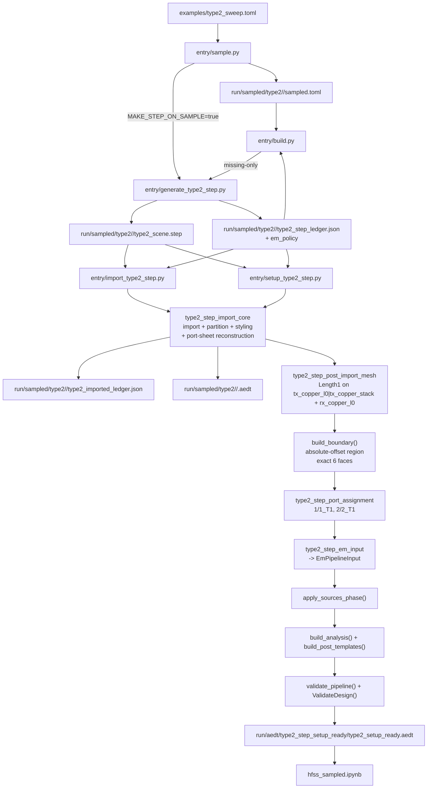

# Type2 STEP to EM Validate Flow

## Notes
- import-only와 setup-ready는 서로 다른 owner surface다.
- `entry/sample.py`의 STEP export는 optional이고, `entry/build.py`가 missing STEP을 same-worker에서 보완할 수 있다.
- imported ledger는 import handoff artifact다. setup-ready summary를 JSON으로 누적하지 않는다.
- `tx_port_sheet` / `rx_port_sheet`는 STEP exact-name body가 아니라 metadata-driven reconstructed sheet다.
- radiation boundary와 explicit lumped port는 setup-ready runtime이 1회만 만든다.
- 0.2.23 document contract에서 underlay footprint source는 coil bounds가 아니라 owner region full bounds다.
- TX underlay는 `tx_region` full `XY` footprint + TX-only `underlay_gap_mm`, RX underlay는 `rx_region_max` full `YZ` footprint + `-X` boundary anchor를 쓴다.
- underlay exact names는 TX `tx_underlay_*`, RX `under_rx_*`이며, underlay exact object/body names는 feature-local rule로 `<= 32` chars다.
- mesh owner는 계속 conductor-only다. underlay bodies는 imported participant지만 mesh target set에는 들어가지 않는다.
