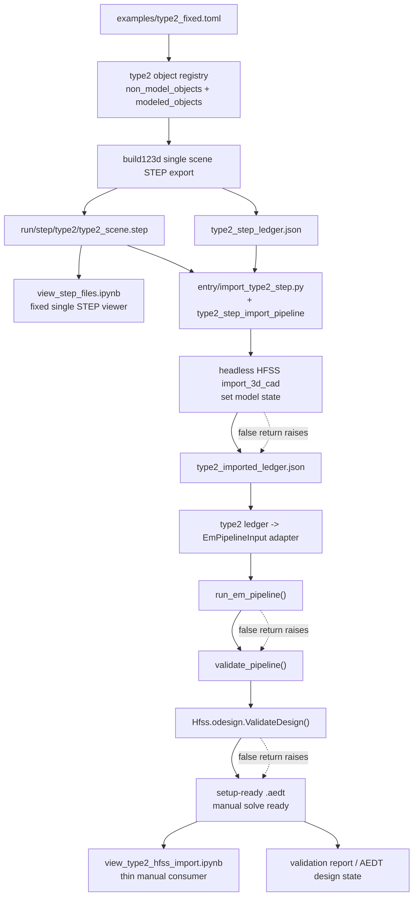

# Type2 STEP to EM Validate Flow

이 다이어그램은 `examples/type2_fixed.toml`에서 canonical single scene STEP, retained metadata ledger, imported ledger, setup-ready HFSS state, 이후 EM validation까지 이어지는 flow를 보여준다. Import+Ledger 구현 계획은 [[sdd/plans/0.2.22-type2-import-ledger-pipeline]], single scene/setup-ready 방향은 [[sdd/plans/0.2.22-type2-single-step-setup-ready-pipeline]], 상위 계획은 [[sdd/plans/0.2.22-type2-step-to-em-validate-pipeline]], TOML 단일화 계획은 [[sdd/plans/0.2.22-type2-toml-unification]], 아키텍처 설명은 [[sdd/architecture/type2-step-to-em-validate-pipeline]]다.

## Notes
- `examples/type2_fixed.toml` is the single planned public authoring input.
- future canonical STEP artifact is one full-scene file: `run/step/type2/type2_scene.step`.
- The STEP ledger and imported ledger are the canonical role/coordinate handoff; AEDT geometry reverse-calculation is not part of the flow.
- Import+Ledger is implemented by [[sdd/code/entry/import_type2_step.py]] and [[sdd/code/src/peetsfea/backend/pyaedt/type2_step_import_pipeline.py]].
- Post-import material/color/transparency is applied by the runtime, not by the notebook.
- `view_step_files.ipynb` is a fixed-path scene viewer, not an index/registry selector notebook.
- Validation includes both repository EM readiness and AEDT design validation.
- `view_type2_hfss_import.ipynb` is a thin manual consumer of runtime-owned setup-ready/manual-solve-ready state, not an owner of that behavior.
- GUI validation is intentionally outside this planned path.
